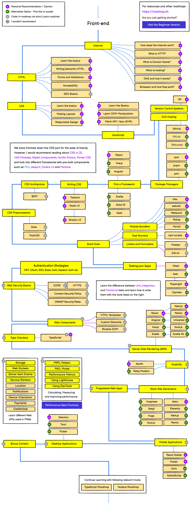
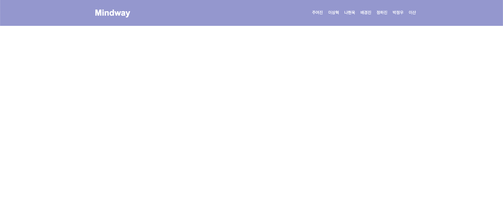

## MindWay 8기 과제 제출 레포지토리입니다.

- 항상 과제를 제출할 때에는 자신의 브랜치를 만들어서 새로 만든 브랜치에만 올려주세요! 개인 브랜치 명은  
  (ex. 과제번호-전공-이름) // 1-iOS-Seojiwan 형식에 맞춰 생성해주세요.

- **과제를 완료하면 PR을 생성하되, 본인 과제 브랜치에서 본인 전공 브랜치로 머지되게 설정한 후 PR을 생성해주세요. (1-iOS-Seojiwan -> Main 대신 1-iOS-Seojiwan -> iOS)**

- PR에서 멘토들의 코멘트를 확인한 후 코멘트에 대한 답장 및 코드 수정을 모두  
  마치고, 어프로브를 두개 이상 받았을 때 자신의 전공에 맞는 브랜치로 머지를 시켜주세요! 앞서 설명했듯, 본인 전공이 FrontEnd일 경우 FrontEnd 브랜치로 머지해주세요.

- Conflict를 방지하기 위해서 항상 코드를 수정할때에는 `git fetch` 명령어와 `git pull` 명령어를 사용해서 원격 저장소와 로컬 저장소를 동기화 시켜주세요.

<small>잘못된 예시. 개인 브랜치에서 main 브랜치로 병합되도록 설정됨</small>

<small>올바른 예시. 개인 브랜치에서 본인 전공 브랜치로 병합되도록 설정됨</small>

만약 본인의 Git, Github의 사용 능력 및 이해도가 떨어진다고 생각된다면 개인적으로 학습하는것을 추천해요.

> 과제를 진행하다 어려운 점이 있으면 [**8기 과제 디코방**](https://discord.gg/ZAV2FRJmv8)에서 선배들에게
> 편하게 디코로 물어봐주세요!

프론트엔드의 길을 걷게 되신걸 축하드립니다!

프론트엔드가 배워야 할, 알아야 할 내용을 담은 로드맵입니다.  
프론트엔드에 처음 입문한 여러분들에게 많은 도움이 될 거에요.

# 첫번째 과제 (과제번호 1번)

HTML, CSS를 이용해서 간단한 웹페이지를 제작해 볼거에요.  
아래 사진과 같은 웹 페이지를 제작해 주세요!

#### 기본 사항

- Header에는 Flex의 Space-Around 속성이 적용되어 있습니다. 가운데로 맞추기 위해 양쪽에 Padding을 적용시키지 않았습니다.
- Header의 Background Color는 `rgb(158, 161, 212)` `HEX #9EA1D4` 입니다.
- Header의 Height는 `100px` 입니다.
- 모든 글씨의 색은 `흰색` 입니다.
- 이름 사이 간격은 `10px` 입니다.

#### 과제 조건

- CSS의 FlexBox 속성을 이용해 개발해주세요.
- HTML 내 `<Style>` 속성을 사용하지 않고 별도의 CSS파일을 생성해서 제작해주세요.
- 시멘틱 코드를 이용하여 개발해주세요!
