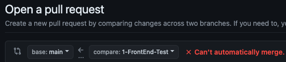
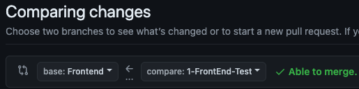

## MindWay 8기 과제 제출 레포지토리입니다.

- 항상 과제를 제출할 때에는 자신의 브랜치를 만들어서 새로 만든 브랜치에만 올려주세요! 개인 브랜치 명은  
  (ex. 과제번호-전공-이름) // 1-iOS-Seojiwan 형식에 맞춰 생성해주세요.

- **과제를 완료하면 PR을 생성하되, 본인 과제 브랜치에서 본인 전공 브랜치로 머지되게 설정한 후 PR을 생성해주세요. (1-iOS-Seojiwan -> Main 대신 1-iOS-Seojiwan -> iOS)**

- PR에서 멘토들의 코멘트를 확인한 후 코멘트에 대한 답장 및 코드 수정을 모두  
  마치고, 어프로브를 두개 이상 받았을 때 자신의 전공에 맞는 브랜치로 머지를 시켜주세요! 앞서 설명했듯, 본인 전공이 FrontEnd일 경우 FrontEnd 브랜치로 머지해주세요.

- Conflict를 방지하기 위해서 항상 코드를 수정할때에는 `git fetch` 명령어와 `git pull` 명령어를 사용해서 원격 저장소와 로컬 저장소를 동기화 시켜주세요.

- **Pull Request 제목은 반드시 (ex. 과제번호-전공-이름) // 1-iOS-Seojiwan 형식으로 설정해주세요. 꼭 준수 부탁드립니다.**

<small>잘못된 예시. 개인 브랜치에서 main 브랜치로 병합되도록 설정됨</small>

<small>올바른 예시. 개인 브랜치에서 본인 전공 브랜치로 병합되도록 설정됨</small>

만약 본인의 Git, Github의 사용 능력 및 이해도가 떨어진다고 생각된다면 개인적으로 학습하는것을 추천해요.

> 과제를 진행하다 어려운 점이 있으면 [**8기 과제 디코방**](https://discord.gg/ZAV2FRJmv8)에서 선배들에게
> 편하게 디코로 물어봐주세요!
