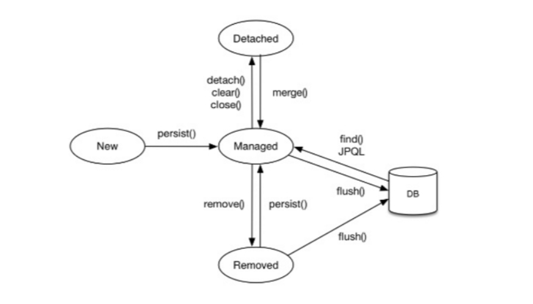
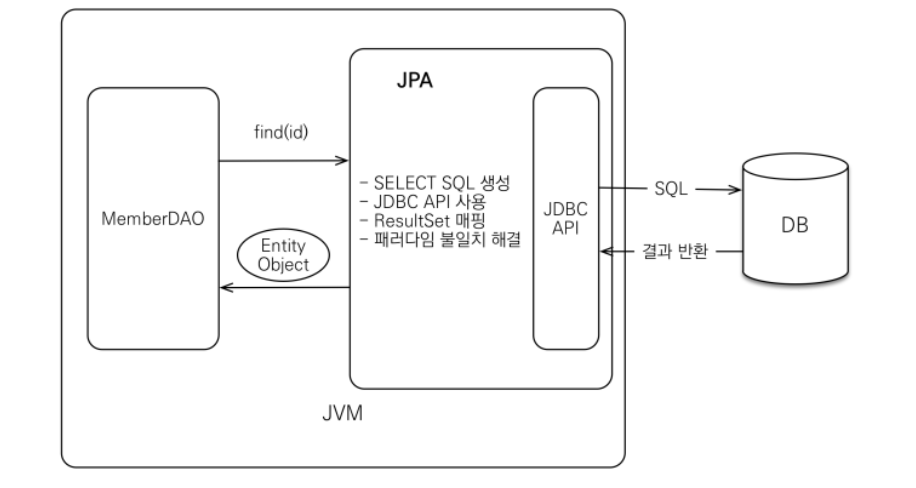

# **Mindway 3**
**back-end**
## jpa 영속성 컨텍스트란?
>jpa 영속성 컨텍스트의 개념

먼저 jpa 영속성 컨텍스트의 의미는 **엔티티**를 영구 저장하는 환경이라는 뜻이다.
###### - jpa에서 엔티티란 DB 테이블에 대응하는 하나의 클래스이다. 
- 영속성 컨텍스트는 애플리케이션과 DB 사이에서 객체를 보관하는 가상 DB 역할을 한다.
-  엔티티 메니저를 통해 엔티티를 영속석 컨텍스트에 보관, 관리 한다.
---
>엔티티 생명주기

- **비영속 상태 :** 영속성 컨텍스트와 관계가 없는 상태

- **영속 상태 :** 영속성 컨텍스트에 저장된 상태

- **준영속 상태 :** 영속성 컨텍스트에 저장되었다가 분리된 상태

- **삭제 상태 :** 삭제된 상태
---
>영속성 컨텍스트의 장점

- **1차 캐시**

영속성 내부에는 1차 캐시가 존재하는데, 영속 상태의 엔티티를 이곳에 저장하므로 만약 엔티티를 조회했을 때 1차 캐시에 엔티티가 존재하면 DB를 찾아보지 않아도 된다.

 - **영속 엔티티의 동일성 보장**

1차 캐시로 반복 가능한 읽기 등급의 **트랜잭션 격리 수준**을 DB가 아닌 애플리케이션 차원에서 제공해 줄 수 있다.

###### -트랜잭션의 격리 수준이란 트랜잭션들끼리 일관성 있는 데이터를 얼마나 허용할 것인지 정해놓은 수준이다.

- **트랜잭션을 지원하는 쓰기 지연**

em.persist()로 객체를 영속성 컨텍스트에 저장해도 DB에 바로 Insert **쿼리**를 날리지 않는다. 
SQL **쿼리**들을 모아놓았다가 영속성 컨텍스트의 변경내용을 DB에 반영할 때 모아둔 **쿼리**를 모두 날린다.

###### -쿼리란 데이터베이스나 데이터 리포지토리 시스템에서 데이터나 정보를 요청하는 것을 의미한다.

- **변경감지**

영속성 컨텍스트에서 엔티티를 조회해서 해당 엔티티를 수정한다고 할때 조회한 엔티티를 다시 업데이트하는 코드가 없어도 영속성 컨텍스트내의 스냅샷과 엔티티를 비교해 변경된 엔티티가 있으면 Update 쿼리를 자동으로 생성한다.

- **지연 로딩**

연관 관계 매핑되어 있는 엔티티를 조회 시 우선 **프록시** 객체를 반환하고, 실제로 필요할 때 쿼리를 날려 가져오는 기능이다.

###### - 프록시란 최종 사용자와 다른 웹사이트 또는 서버 사이의 가교 역할을 하는 물리적 또는 가상 서버이다.
---
## jpa란?
>jpa의 개념

- jpa는 자바에서 사용하는 **ORM**기술 표준이다.
- jpa는 자바 애플리케이션과 **JDBC**사이에서 동작하고 자바인터페이스로 정의되어 있다.
###### -JDBC는 자바 프로그래밍 언어를 사용해 데이터베이스에 접근할 수 있도록 하는 자바 API이다. -> 자바 API란 자바를 사용하여 쉽게 구현할 수 있도록 한 클래스 라이브러리의 집합이다.
### ORM: Object-Relational Mapping(객체 관계 매핑)
- 객체와 관계형 데이터베이스의 데이터를 매핑하는 기술이다.

- ORM 프레임워크가 객체와 데이터베이스 중간에서 매핑한다.

- 객체와 테이블을 매핑하여 패러다임 불일치 문제를 해결한다.
---
>jpa의 동작

- JPA는 JDBC API를 사용하여 데이터베이스와 데이터를 주고받게 된다.

- **저장**
1. MemberDAO 클래스를 통해 persist()를 실행하면, JPA가 Entity 객체를 분석하여 SQL문을 생성한다.

2. JDBC API를 사용하여 DB에 생성된 INSERT SQL을 보내게 된다.

3. 이 과정에서 JPA는 객체와 데이터베이스 테이블의 패러다임 불일치를 해결한다.
- **조회**
1. MemberDAO 클래스를 통해 find(id)를 실행하면, JPA는 SELECT SQL을 생성한다.

2. JDBC API를 사용하여 생성된 SELECT SQL을 보낸다.

3. DB에서 반환된 정보를 ResultSet 매핑을 통해 객체로 변환해 준다.

4. 이 과정에서도 패러다임 불일치 문제를 해결해 준다.
---
>jpa를 사용하는 이유

기존의 개발 방식은 SQL 중심적인 개발이였지만 jpa를 사용하면 객체 중심으로 애플리케이션 개발이 가능하다.
- **생산성**

jpa를 사용하면 기본적으로 생산성이 높아진다. JDBC 방식의 경우 SQL 쿼리문을 직접 작성해야 데이터베이스에 접근할 수 있지만 jpa는 쿼리문을 별도로 작성할 필요가 없기 때문에 간단한 메서드를 통해 저장, 조회, 수정, 삭제가 가능하다.
- **유지보수**

기존에는 엔티티 클래스의 필드가 변경되면 모든 SQL을 수정해야 했지만, 필드가 변경되더라도 매핑 정보만 잘 연결하면 SQL문은 자동으로 작성된다.

---

